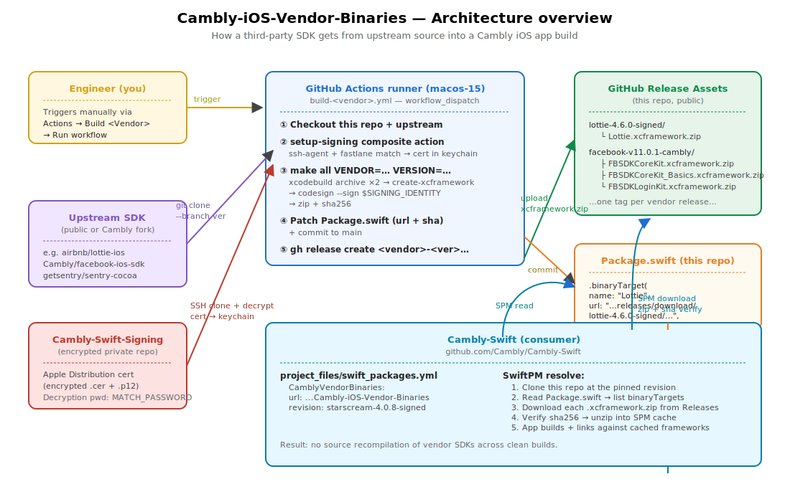
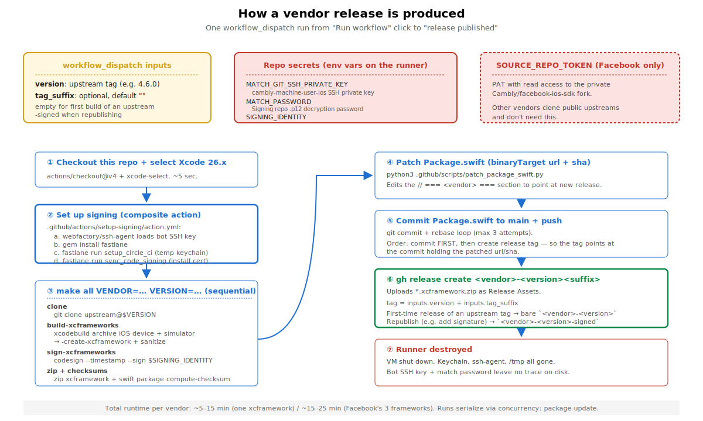

# Cambly-iOS-Vendor-Binaries

Prebuilt, code-signed `.xcframework` distribution of vendored iOS SDKs for Cambly's iOS apps (Adults, Kids, Lexicon). Wraps upstream sources (or Cambly forks where applicable) so Cambly-Swift skips recompilation of these vendors on every clean build, and ships them with the team's Apple Distribution signature so Apple's SDK Signature requirement (ITMS-91065) is satisfied.

See [MOB-222](https://cambly.atlassian.net/browse/MOB-222) for the initial migration context and [MOB-288](https://cambly.atlassian.net/browse/MOB-288) for the SDK Signature follow-up.

## Why this repo exists

Two problems with shipping these third-party SDKs as **source-form SwiftPM dependencies** in Cambly-Swift directly:

1. **Build time.** Facebook SDK / Lottie / Sentry / Realm etc. add up to >30s of clean-build recompilation each, on every CI run and every developer's `Cambly.xcworkspace` clean. Across hundreds of clean builds per day this is a large compounding cost. As prebuilt xcframeworks, SwiftPM resolves them as fixed binary artifacts (cached locally after the first download) and the toolchain skips compilation entirely.

2. **App Store SDK Signature requirement.** Apple [requires xcframeworks of a specific list of "commonly used third-party SDKs"](https://developer.apple.com/support/third-party-SDK-requirements/) (Facebook, Lottie, RealmSwift, SDWebImage, Starscream — and a growing list) to carry a top-level Apple Distribution signature, or App Store Connect rejects the upload with `ITMS-91065: Missing signature`. We were grandfathered for a while; Lexicon v1.2.6 (May 2026) was the first to be rejected, triggering this repo's signing pipeline.

This repo's purpose: have one place that owns the build-and-sign of every vendored SDK, exposes them via `binaryTarget` URLs in a shared `Package.swift`, and Cambly-Swift consumes that single SwiftPM package.

Versions tracked:

| Vendor product | Upstream source | Current release tag | Build via |
|---|---|---|---|
| `FBSDKLoginKit` (+ `FBSDKCoreKit` + `FBSDKCoreKit_Basics` transitive) | `Cambly/facebook-ios-sdk@v11.0.1-cambly` (private Cambly fork) | `facebook-v11.0.1-cambly` | `FBSDK*-Dynamic` schemes in `FacebookSDK.xcworkspace` |
| `Alamofire` | `Alamofire/Alamofire@5.12.0` | `alamofire-5.12.0` | `Alamofire iOS` scheme in `Alamofire.xcodeproj` |
| `Lottie` | `airbnb/lottie-ios@4.6.0` | `lottie-4.6.0` | `Lottie (iOS)` scheme in `Lottie.xcodeproj` |
| `KeychainAccess` | `kishikawakatsumi/KeychainAccess@v4.2.2` | `keychainaccess-v4.2.2` | `KeychainAccess` scheme in `Lib/KeychainAccess.xcodeproj` |
| `DeviceKit` | `devicekit/DeviceKit@5.8.0` | `devicekit-5.8.0` | `DeviceKit` scheme in `DeviceKit.xcodeproj` |
| `SDWebImage` | `SDWebImage/SDWebImage@5.21.7` | `sdwebimage-5.21.7` | `SDWebImage` scheme in `SDWebImage.xcodeproj` |
| `Sentry` | `getsentry/sentry-cocoa@9.13.0` | `sentry-9.13.0` | `Sentry` scheme in `Sentry.xcodeproj` |
| `PostHog` | `PostHog/posthog-ios@3.58.3` | `posthog-3.58.3` | `PostHog` scheme in `PostHog.xcodeproj` |
| `IterableSDK` | `Iterable/iterable-swift-sdk@6.7.1` | `iterable-6.7.1` | `swift-sdk` scheme in `swift-sdk.xcodeproj` (scheme builds `IterableSDK.framework`) |
| `Starscream` | `daltoniam/Starscream@4.0.8` | `starscream-4.0.8` | `Starscream` scheme in `Starscream.xcodeproj` |
| `FastboardSDK` + `Whiteboard` + `NTLBridge` + `White_YYModel` (the Netless stack) | `netless-io/fastboard-iOS@1.4.1` (+ transitive `Whiteboard-iOS@2.16.89`, `DSBridge-IOS`, `White_YYModel`) | `fastboard-1.4.1-r2` | **CocoaPods-mode** — `Fastboard` / `Whiteboard` / `NTLBridge` / `White_YYModel` schemes in `pod install`-generated `Example/Fastboard.xcworkspace`. Fastboard's module is renamed to `FastboardSDK` (the `.library` product stays `Fastboard`). See "CocoaPods-mode vendors" below. |

Cambly-Swift pins this repo by `revision: <vendor>-<version>` (typically the most recently bumped vendor's tag — the commit at that tag carries all vendors' current URLs/checksums, since each workflow patches the shared `Package.swift`).

### CocoaPods-mode vendors (the Netless whiteboard stack)

Every vendor above builds from a **committed standalone xcodeproj** at its upstream root. The Netless stack is the one exception and uses a distinct build path (`USE_COCOAPODS=1` in the Makefile):

- **One clone, four frameworks.** `netless-io/fastboard-iOS` is a 4-repo dependency cluster: `Fastboard → Whiteboard → { NTLBridge (the DSBridge-IOS pod), White_YYModel }`. There is no committed library xcodeproj; the only buildable, framework-producing project is the **CocoaPods-generated `Example/Fastboard.xcworkspace`**. `build-fastboard.yml` runs `pod install` there and archives all four pod-target schemes in one pass — so this single workflow delivers both **MOB-339** (Fastboard) and **MOB-340** (Whiteboard + DSBridge + White_YYModel).
- **Why Fastboard's Example, not Whiteboard's.** Only Fastboard's `Example/Podfile` has `use_frameworks!` enabled (→ each pod is a dynamic `.framework` we can package). Whiteboard-iOS's own Example has it commented out (static-lib mode → no `.framework`), so the whole stack is built from fastboard-iOS.
- **All four must ship + embed.** Under `use_frameworks!` the four are separate dynamic frameworks that dyld-link each other at runtime; they are **not** statically absorbed into `Fastboard.framework`. Shipping fewer → `dyld: Library not loaded: @rpath/NTLBridge.framework/NTLBridge` crash on device. Hence four `.binaryTarget`s, and the consuming app must declare every one directly (see "Audit every app target").
- **Scheme names.** The real pod-target scheme names (verified via `xcodebuild -list` on 1.4.1) are `Fastboard` / `Whiteboard` / `NTLBridge` / `White_YYModel` — **not** the stale `dsBridge` / `YYModel` names in upstream's own `xcframework.sh`.
- **Fastboard's module is renamed to `FastboardSDK`.** Fastboard's module contained a top-level `public class Fastboard`, colliding with the module name. With library evolution the emitted `.swiftinterface` writes module-qualified refs like `Fastboard.OperationBarDirection`; a *different* Swift version recompiling that interface resolves `Fastboard` to the class and fails (`'OperationBarDirection' is not a member type of class 'Fastboard.Fastboard'`). This broke consuming the binary on Xcode 26.5 (Swift 6.3.2) when it was built on the GHA runner's Xcode 26.3 (Swift 6.2.4); collision-free vendors (Alamofire, Whiteboard, …) round-trip across versions fine. `patch_fastboard_podspec.py` injects `s.module_name = 'FastboardSDK'` so the module name no longer collides with the class — restoring true cross-Xcode version independence (no per-Xcode rebuilds). The CocoaPods scheme stays `Fastboard` but emits `FastboardSDK.framework`; the binaryTarget is `FastboardSDK` while the `.library` **product** name stays `Fastboard`. The public `Fastboard` class is unchanged, so Cambly-Swift only swaps the import (`import Fastboard` → `import FastboardSDK`). The other three pods have no same-name class and keep their names.
- **Whiteboard version pin.** Fastboard 1.4.1 only requires `Whiteboard ~> 2.16.81`, but Cambly-Swift consumes 2.16.89 via SPM. `.github/scripts/patch_fastboard_podfile.py` injects `pod 'Whiteboard', '2.16.89'` into the Example Podfile before `pod install` to keep the binary at the version Cambly ships. Transitive `NTLBridge` / `White_YYModel` CocoaPods version numbers differ from their SPM tags (e.g. pod `NTLBridge 3.1.x` vs SPM `DSBridge-IOS 3.2.1`) and cannot be byte-aligned across package managers — the code is equivalent.
- **Resource bundles — verify on first build.** The Example workspace also contains CocoaPods resource-bundle schemes (`Fastboard-Icons`, `Fastboard-LocalizedStrings`, `Whiteboard-Whiteboard`). With `use_frameworks!` these are expected to land inside each `.framework`; the Makefile's post-archive `find` dump shows the framework contents — confirm the resources are present before signing/shipping the first release.
- **Runner needs CocoaPods.** macos-15 ships it preinstalled; `build-fastboard.yml` verifies `pod --version` and installs it if missing. Local runs need a working `pod` (the brew-cocoapods + rbenv combo on some machines mis-resolves the `ffi` gem — use a clean Ruby).

More vendors may be added — see "Adding a new vendor" below. Google auth stack (`GoogleSignIn` / `GTMAppAuth` / `AppAuth` / `GTMSessionFetcher`) is currently **blocked**: those packages are SPM-only (no upstream xcodeproj), and our xcodeproj-mode pipeline doesn't fit. Other SPM-only candidates in Cambly-Swift today (`InstantSearch`, `BSON`, `Nantes`, `Reusable`, `MultiSlider`) face the same constraint — they would need a `swift-create-xcframework` based pipeline; see the abandoned attempt for Google auth in git history (reverted in `113f18b`) for the negative result and the kinds of issues that path runs into.

## How it works



A single `Package.swift` declares one `.library` product per vendor, each backed by one or more `.binaryTarget`s pointing at GitHub Release assets of this repo. Cambly-Swift adds this repo once in `swift_packages.yml` and references the relevant products in its target dependency lists — same usage shape as any source-form SwiftPM package.

Vendor sections inside `Package.swift` (both in `products:` and `targets:`) are delimited by `// === <vendor-key> ===` marker comments. The marker convention is load-bearing: `.github/scripts/patch_package_swift.py` uses it to locate the section to rewrite on each release.

## How a vendor release is produced

The build + sign + publish pipeline runs as one GitHub Actions workflow per vendor. Manual trigger (workflow_dispatch) only — vendor upgrades are infrequent, so there's no schedule or auto-trigger.



Step ② (`Set up signing`) is the shared composite action at `.github/actions/setup-signing/action.yml` — every `build-*.yml` calls it. It owns ssh-agent + fastlane install + setup_circle_ci + sync_code_signing. The Makefile's `sign-xcframeworks` target then invokes `codesign --sign $SIGNING_IDENTITY` against the cert that match installed.

## Operational gotchas

Things that have bitten this repo's release flow. Read before bumping or rebuilding any vendor.

### Build pipeline

#### The Makefile strips dev-time files from every `.framework`

Framework bundles built via `xcodebuild archive` honor whatever the upstream xcodeproj declares in its **Copy Bundle Resources** phase. Some upstream projects accidentally land dev-time scripts/sources there — e.g. PostHog 3.58.3 ships `generate-pb-c.sh`, a PLCrashReporter `protoc-c` codegen helper. Source-form SwiftPM excludes such files via `Package.swift`'s `exclude:`, but our pipeline doesn't honor that — it obeys the xcodeproj.

If such a file reaches the consuming app's `Frameworks/` dir, **App Store Connect rejects the IPA with error 90035 "Code object is not signed at all"**. `altool` treats any non-Mach-O file inside a framework bundle as nested code that must be signed, and a shell script (or `.swift` / `.c` / `Makefile` / etc.) can't be signed. The reject only surfaces at TestFlight/App Store upload — simulator builds and even on-device dev builds don't trip it.

The Makefile's `build-xcframeworks` target therefore strips a broad list of dev-time file types (`*.sh / *.py / *.swift / *.c / Makefile / ...`) from each `.framework` slice before `-create-xcframework`. Canonical framework contents (`Mach-O / Info.plist / Headers/ / Modules/ / PrivateHeaders/ / Resources/ / PrivacyInfo.xcprivacy`) are not matched. If you add a new vendor and discover the sanitize step removes something it shouldn't, narrow the pattern — don't disable the step.

#### Don't reuse a release tag once consumers have pulled it

Consumers cache `binaryTarget` downloads in `~/Library/Caches/org.swift.swiftpm/artifacts/`, **keyed by URL**. If you delete-and-recreate a release tag with different zip contents (the per-vendor workflows do `gh release delete --cleanup-tag && gh release create`), every consumer with a populated cache will fall into one of two bad states:

1. **`checksum of downloaded artifact ... does not match checksum specified by the manifest`** — SwiftPM serves the old zip from cache, but `Package.swift` advertises the new sha256.
2. **`binary target 'X' could not be mapped to an artifact with expected name 'X'`** — after a partial cache clear, an empty `<Product>/` directory remains in `<DerivedData>/SourcePackages/artifacts/cambly-ios-vendor-binaries/`.

Recovery requires every developer (and CI cache layer) to manually `rm -rf` the stale cache entries. This bit us hard on `posthog-3.58.3` — see PR Cambly-Swift#4081.

**Rule**: the first release of a given upstream version uses `<vendor>-<version>` as the tag. Any rebuild at the same upstream version (e.g. fixing a packaging bug, not a code change) must go out under a fresh tag — `<vendor>-<version>-<suffix>` is fine (`posthog-3.58.3-codesign-fix`, `lottie-4.6.0-r2`). A new tag means a new URL, which means a fresh cache key, which means every consumer auto-redownloads cleanly with zero local intervention.

Every `build-*.yml` workflow exposes an optional **`tag_suffix`** workflow_dispatch input for exactly this purpose. Default empty (first release of an upstream version). Pass `-signed`, `-r2`, etc. when republishing.

### Signing pipeline (SDK Signature / ITMS-91065)

The xcframeworks shipped from this repo are codesigned with the team's Apple Distribution identity (`Apple Distribution: Cambly Inc. (ZNP9AYBP23)`). Required for SDKs on Apple's [commonly used third-party SDK list](https://developer.apple.com/support/third-party-SDK-requirements/) (Facebook / Lottie / Realm / SDWebImage / Starscream) since 2024; missed by Lexicon 1.2.6 in May 2026 → ITMS-91065 rejection → led to this whole pipeline.

The signing setup is encapsulated in `.github/actions/setup-signing/` (composite action). Each `build-*.yml` calls it once; the Makefile's `sign-xcframeworks` target then runs codesign against `${SIGNING_IDENTITY}`. The non-obvious bits learned the hard way:

#### `fastlane run setup_ci` ≠ `fastlane run setup_circle_ci` on GHA

`setup_ci` calls `detect_provider` which only recognizes CircleCI and CodeBuild environments — on GHA's macos-15 runner it silently does **nothing**. `setup_circle_ci` skips the detection and unconditionally runs the keychain setup, so it **does work on GHA** despite the name. Use `setup_circle_ci` here, not `setup_ci`. (See run 26504963206 attempt 2 for the time we got bitten.)

#### GHA per-step shell isolation requires `$GITHUB_ENV` for fastlane setup_circle_ci to compose with later steps

`setup_circle_ci` exports `MATCH_KEYCHAIN_NAME` and `MATCH_KEYCHAIN_PASSWORD` to the **fastlane Ruby process** env, then dies. GHA runs each step in its own shell, so the env vars don't survive into the next step where `fastlane run sync_code_signing` would read them. Persist them via `$GITHUB_ENV` in the same step:

```bash
fastlane run setup_circle_ci
echo "MATCH_KEYCHAIN_NAME=fastlane_tmp_keychain" >> "$GITHUB_ENV"
echo "MATCH_KEYCHAIN_PASSWORD=" >> "$GITHUB_ENV"
```

This is already handled inside the `setup-signing` composite action — flagged here because if you ever inline these steps again (e.g. in a debug workflow), you have to remember the `$GITHUB_ENV` lines or match will install the cert into the wrong keychain. (CircleCI doesn't need this since a whole fastlane lane runs in a single Ruby process; the env stays alive for the whole `before_all` + lane body.)

#### `codesign` hangs forever on a misconfigured keychain (UI prompt)

If the imported cert's partition list isn't configured, `codesign` triggers a keychain-access UI permission popup. GHA runners are headless — nothing answers the popup, and codesign hangs until the job hits the 6-hour timeout. Symptom: a "Build + sign …" step that normally takes 3 min sits at 7+ min with no obvious failure.

`fastlane sync_code_signing` configures the partition list automatically **only if it knows the destination keychain's password**. Two ways to satisfy that:

1. Recommended (what `setup-signing` does): `setup_circle_ci` creates `fastlane_tmp_keychain` with empty password, and we tell match to install there via the env vars above. match's partition-list call then succeeds.
2. Alternative: pass `keychain_name:login.keychain-db keychain_password:<the runner's actual login.keychain password>` to match. The runner's login.keychain password on macos-15 is **not** an empty string (verified: `security set-key-partition-list -k ""` returns `SecKeychainItemSetAccessWithPassword: The user name or passphrase you entered is not correct`). It's also not documented anywhere stable. Avoid this path.

If `codesign` ever hangs again, this is the first thing to check — verify `security find-identity -v -p codesigning` shows the cert and `security set-key-partition-list -S apple-tool:,apple: -s -k <pwd> <keychain>` exits 0.

### GitHub Actions specifics

#### `concurrency: { cancel-in-progress: false }` still cancels pending runs

Each `build-*.yml` uses `concurrency: { group: package-update, cancel-in-progress: false }` to serialize the `git push origin main` step. We expected this to queue concurrent runs and run them in order. **It doesn't.** Per [GHA docs](https://docs.github.com/en/actions/using-jobs/using-concurrency): "Any previously pending job or workflow in the concurrency group will be cancelled."

Effect: triggering N workflows in the same group within a few seconds leaves you with the first run in_progress + the **last** run pending. The N–2 runs in the middle all get cancelled.

**Don't loop over `gh workflow run` to mass-trigger.** Either:
- Trigger one, wait for it (`gh run watch`) to finish, then trigger the next. There's a sequential trigger script template at `/tmp/sequential-trigger.sh` (locally on huihuang's machine; recreate from this README if needed).
- Or run a single matrix job inside one workflow file (not done yet).

#### Some Markdown / log notes

- `gh run view --log` returns empty on in-progress runs. To inspect logs while a run is mid-flight, either wait for it to finish, or use the GHA UI (live tail). Cancelling the run unblocks `--log`.


## Upgrading an existing vendor

Each vendor has its own `workflow_dispatch` workflow in **Actions**.

1. **Actions → Build &lt;Vendor&gt; → Run workflow**, set `version` to the new upstream tag/ref, **Run**.
2. The workflow (~15-30 min) does:
   - Clone upstream at that version
   - For each scheme: `xcodebuild archive` for iOS device + iOS simulator with `BUILD_LIBRARY_FOR_DISTRIBUTION=YES`, then `xcodebuild -create-xcframework`, zip, sha256
   - Patch this vendor's `// === <vendor> ===` section in `Package.swift` with new URLs + checksums
   - Commit + push `Package.swift` to `main`
   - Create GitHub release `<vendor>-<version>` with the zipped xcframeworks as assets
3. In Cambly-Swift, bump `project_files/swift_packages.yml` to the new vendor tag:
   ```diff
    CamblyVendorBinaries:
      url: git@github.com:Cambly/Cambly-iOS-Vendor-Binaries
   -  revision: devicekit-5.7.0
   +  revision: alamofire-5.11.0
   ```
   It doesn't matter which vendor tag you pin to — the commit at that tag carries the patched URL/checksum for **all** vendors. Convention: bump to whatever vendor you just released.
4. Verify locally, then open a Cambly-Swift PR — diff should be just that one yml line plus an auto-updated `Package.resolved`.

## Adding a new vendor (4 steps)

Each vendor is: one `.library` product, N `.binaryTarget`s, one Makefile section, one GHA workflow. Marker comments tie everything together. Reference `build-alamofire.yml` (single-framework public upstream) or `build-facebook.yml` (multi-framework private fork) as templates.

1. **`Package.swift`** — under `products:`, add a `// === <vendor-key> ===` marker line and a `.library(name: "<ProductName>", targets: [...])`. Under `targets:`, add the same marker line and N `.binaryTarget(name: ..., url: "...PENDING...", checksum: "0000…")` entries. Use 64 hex zeros as the placeholder checksum; the first workflow run patches everything to real values.
2. **`Makefile`** — add a per-vendor `ifeq` block. Two patterns depending on upstream layout:
   ```makefile
   # Pattern A — upstream xcodeproj/xcworkspace at root
   ifeq ($(VENDOR),<vendor-key>)
     BUILD_PROJECT_FLAG := -project <Name>.xcodeproj    # or -workspace <Name>.xcworkspace
     SCHEME_PRODUCT_PAIRS := "<scheme>:<output-product-name>"
   endif

   # Pattern B — xcodeproj in a subdirectory (e.g. KeychainAccess uses Lib/)
   ifeq ($(VENDOR),<vendor-key>)
     BUILD_PROJECT_FLAG := -project Lib/<Name>.xcodeproj
     SCHEME_PRODUCT_PAIRS := "<scheme>:<output-product-name>"
   endif
   ```
   Add `<vendor-key>` to the `case` statement in `require-args`. Use quoted `"scheme:product"` tokens to handle scheme names with spaces / parens (e.g. `"Alamofire iOS:Alamofire"`, `"Lottie (iOS):Lottie"`).
3. **`.github/workflows/build-<vendor>.yml`** — copy `build-alamofire.yml` (simplest template), change:
   - `name:` and the `workflow_dispatch` description / default version
   - `VENDOR` env (used by patch script)
   - `ASSETS_TAG: <vendor-key>-${{ inputs.version }}`
   - The `<TargetName>_SHA` env vars list (one per `.binaryTarget` you declared in step 1)
   - `UPSTREAM_REPO_URL` in the `make all` invocation
   - Release tag in the `gh release create` step

   Keep `concurrency: { group: package-update, cancel-in-progress: false }` and the `git fetch origin main && git rebase origin/main` retry loop — they prevent race-on-push when two vendor workflows touch `Package.swift` in close succession.
4. **Cambly-Swift** —

   a. **Rename package refs.** In every `project_files/*.yml` that references the upstream package, replace `package: <UpstreamSPMPackage> / product: X` with `package: CamblyVendorBinaries / product: X`. Remove the old `<UpstreamSPMPackage>` entry from `swift_packages.yml`. Bump the `revision:` pin to the new vendor's tag.

   b. **Audit every app target for direct embed declarations.** ⚠️ *This is the load-bearing step.* When a vendor moves from source-form SPM to a binary xcframework, every `application` target that uses the vendor (even transitively through an intermediate framework like `Networking` or `Syntax`) must declare the binary product **directly** in its own `dependencies:` list — not only on the intermediate framework. SPM auto-embeds binary xcframeworks into `.app/Frameworks/` *only* for products that are direct deps of the app target; transitive declarations through framework targets are silently link-but-not-embed, and the app crashes on real devices at launch with `dyld[..]: Library not loaded: @rpath/X.framework/X`. Source-form deps don't have this issue (the consumer framework statically absorbs the compiled code), which is what hid the gap before vendoring.

   The 4 places to update (Cambly-Swift has 7 app targets total — 4 production apps + 3 preview hosts):

   | App target | yml file | Used by |
   |---|---|---|
   | `Cambly` | `shared_swift_packages_dependencies.yml` (`SharedSPMDependencies` template) | Adults |
   | `CamblyKids` | `shared_swift_packages_dependencies.yml` (same template) | Kids |
   | `Lexicon` | `lexicon_target.yml` | Lexicon |
   | `ComponentsApp` | `components_app.yml` | Components preview host |
   | `SyntaxApp` | `syntax_app.yml` | Syntax preview host |
   | `SyntaxSwiftUIApp` | `syntax_swiftui_app.yml` | Syntax SwiftUI preview host |
   | `LexiconComponentsApp` | `lexicon_components_app.yml` | Lexicon Components preview host |

   For each app target that (transitively) imports the new vendor, add:

   ```yml
   - package: CamblyVendorBinaries
     product: <ProductName>
   ```

   Do **not** add `embed: true` / `codeSign: true` flags — SPM handles auto-embed for `binaryTarget` products itself, and explicit flags actually conflict with that and break the Copy Frameworks build phase (caught us on Lottie in PR #4040).

   c. **Run the lint:** `python3 scripts/lint_binary_embeds.py` walks every app target's transitive deps and fails if any binary product is used but not declared directly. CI also runs this as the `check-binary-embeds` job; you can run it locally before pushing.

   d. **Verify on a real device.** A successful `xcodebuild build` on iOS Simulator is **not sufficient** — simulator dyld searches `Build/Products/.../PackageFrameworks/` in addition to `.app/Frameworks/`, masking missing embeds. The crash only surfaces on a physical device. Plug in a phone, install + launch each app (adults / kids / lexicon) at least once before merging. The CI lint above catches the obvious cases at PR time but isn't a complete substitute for an on-device launch.

   ⚠️ **Watch for single-line `- package: X` shortcuts** in yml — xcodegen lets you omit `product:` when it matches the package name. Those break after rename to `CamblyVendorBinaries` (no product named `CamblyVendorBinaries` exists). Always add an explicit `product: <Original>` line after the rename. (Caught us on `login.yml` for DeviceKit.)

## One-time setup

For vendors with **private** upstream repos (Cambly forks), this repo needs a `SOURCE_REPO_TOKEN` secret:

- Settings → Secrets and variables → Actions → New repository secret
- Name: `SOURCE_REPO_TOKEN`
- Value: a fine-grained PAT with **Read** access to **Contents** on the relevant Cambly org repos (e.g. `Cambly/facebook-ios-sdk`)

Public upstreams don't need this token — their `UPSTREAM_REPO_URL` uses the unauthenticated form.

## Local fallback

If GitHub Actions is unavailable:

```bash
make all VENDOR=alamofire VERSION=5.10.2 \
  UPSTREAM_REPO_URL=https://github.com/Alamofire/Alamofire.git
# Outputs build/artifacts/*.xcframework.zip
```

Compute checksums with `swift package compute-checksum`, then manually:
- Upload zips as a new GitHub Release (`gh release create alamofire-5.10.2 --cleanup-tag build/artifacts/*.xcframework.zip`)
- Patch `Package.swift` (run `.github/scripts/patch_package_swift.py` the same way the workflow does, or edit the `// === <vendor> ===` section by hand)
- Commit + push

## Why a single xcframework slice per vendor

This repo builds every framework with `BUILD_LIBRARY_FOR_DISTRIBUTION=YES`, which emits `.swiftinterface` files forward-compatible across Xcode versions. So one xcframework per scheme works across the 26.x family.

Contrast `Cambly-Realm-Binary`, which ships 4 slices (Xcode 26.1 / 26.2 / 26.3 / 26.4.1) because its build doesn't enable library evolution — `.swiftmodule` is tied to the exact compiler version. If a future vendor's source can't compile with library evolution (rare; usually fails in emit-module), escalate at that point and add per-Xcode slicing.

## Why a monorepo vs per-vendor repo

Unlike `Cambly-PromiseKit-Binary` / `Cambly-RxSwift-Binary` which are per-vendor, this repo houses multiple vendors to keep repo count down (5-6 near-identical per-vendor repos would be more drag than they save). The trade-off: vendor builds queue via the `package-update` concurrency group, but they're rare and slow anyway so queuing doesn't matter.
